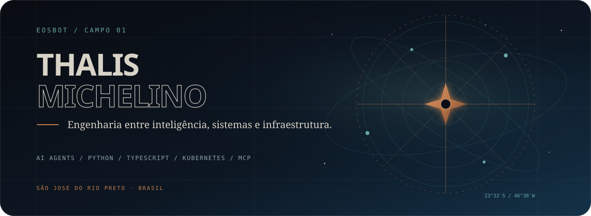
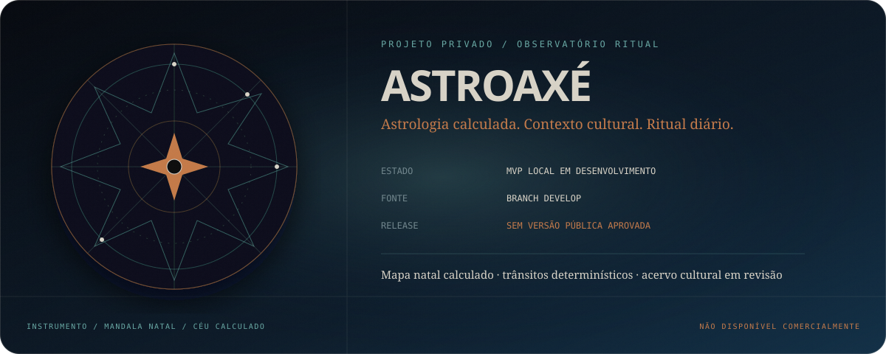

<div align="center">
  <a href="https://www.linkedin.com/in/thalis-uriel-choeiri-michelino-9b125813a/">LinkedIn</a>
  &nbsp;·&nbsp;
  <a href="mailto:thalis224@hotmail.com">Email</a>
  &nbsp;·&nbsp;
  <a href="https://github.com/EosBot?tab=repositories">Repositórios</a>
</div>

<br />

## Engenharia como instrumento

Sou desenvolvedor e analista de infraestrutura. Meus projetos públicos atravessam **sistemas de agentes, ferramentas para desenvolvedores, segurança, SaaS vertical, automação e fabricação digital**.

Não trato IA como uma camada isolada. O trabalho aparece no sistema inteiro: domínio, dados, APIs, testes, containers, operação e documentação que outra pessoa consegue inspecionar.

```text
CAMPO 01  agentes e ferramentas       LangGraph · MCP · Python
CAMPO 02  aplicações e plataformas    TypeScript · Next.js · NestJS
CAMPO 03  infraestrutura              Docker · Kubernetes · Linux
CAMPO 04  dados e persistência         PostgreSQL · Prisma · Redis
```

## AstroAxé — produto em órbita privada



**AstroAxé está em desenvolvimento e ainda não possui versão promovida para produção.** A `develop` contém o MVP local; a `main` permanece reservada para snapshots aprovados.

O projeto é um aplicativo web responsivo de **astrologia calculada, regências culturais contextualizadas e ritual diário**. O que existe hoje no código:

- onboarding guest-first em quatro etapas: nome, data, hora opcional e cidade;
- cálculo do mapa natal com timezone IANA e tratamento explícito para hora desconhecida;
- primeiro mapa exibido antes de cadastro ou paywall;
- contas, perfis e sessões opacas no MVP local;
- trânsitos determinísticos com janelas de início, pico e fim;
- corpus cultural e motor de regências em pesquisa, com ativação pública bloqueada até calibração.

O produto **não está disponível comercialmente**. Esta apresentação registra o trabalho em andamento sem antecipar funcionalidades, preço, clientes ou resultados que o repositório não comprova.

## Coordenadas públicas

### 01 / [Awesome ZooCode Skills](https://github.com/EosBot/awesome-zoocode-skills)

Coleção organizada de **899 Agent Skills** para assistentes de código, com catálogo, especificação de front matter, instalação local e automação via Composio.

`AI agents` `MCP` `Python` `developer tooling`

### 02 / [Argus 2.0](https://github.com/EosBot/argus)

Plataforma local para investigações OSINT e Tor orientadas a casos, com preservação de fontes, trilha de auditoria, RBAC e documentação operacional.

`Python` `OSINT` `segurança` `investigação`

### 03 / [CPQ Painéis Elétricos](https://github.com/EosBot/cpq-paineis-eletricos)

SaaS multi-tenant de configure-price-quote para fabricantes de painéis elétricos, estruturado como monorepo com NestJS, Next.js, Prisma e PostgreSQL.

`TypeScript` `NestJS` `Next.js` `Prisma`

### 04 / [Assessoria de TI](https://github.com/EosBot/assessoriadeti)

Runbook de implantação e hardening para uma stack self-hosted de automação conversacional com Typebot, n8n, Traefik, Portainer e Chatwoot.

`Docker` `n8n` `Traefik` `operações`

### 05 / [Perfis OrcaSlicer para Ender-3 V3 KE](https://github.com/EosBot/orcaslicer-ender3v3ke-profiles)

Configuração prática para impressão 3D: **9 perfis de filamento, 27 perfis de processo e 1 perfil de máquina**, com parâmetros e instruções de importação documentados.

`OrcaSlicer` `Klipper` `impressão 3D` `calibração`

---

<div align="center">
  <strong>Código antes de promessa.</strong><br />
  <sub>Leia os repositórios, examine as decisões e abra uma conversa a partir do trabalho real.</sub><br /><br />
  <a href="mailto:thalis224@hotmail.com">thalis224@hotmail.com</a>
  &nbsp;·&nbsp;
  <a href="https://github.com/EosBot?tab=repositories">github.com/EosBot</a>
</div>
